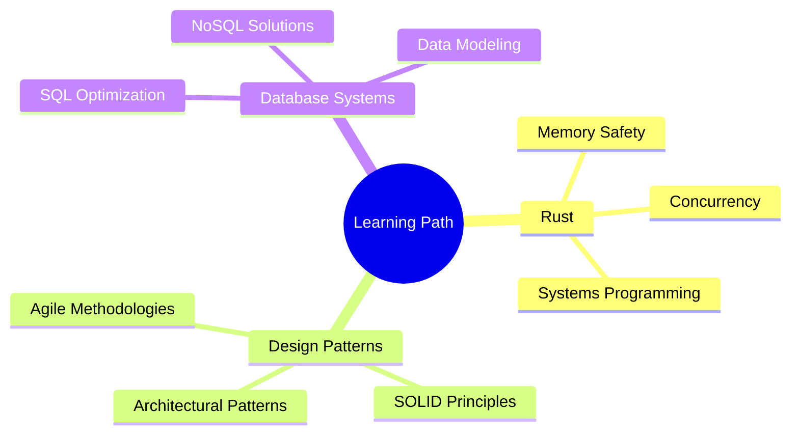

<div align="center">
  
  
  # José Uriel Slavkis
  
  [](https://linkedin.com/in/joseslavkis)
  [](https://github.com/joseslavkis)
  [](https://yourportfolio.com)
  
  ### 💻 Software Engineering Student | University of Buenos Aires
  
  <p>
    <a href="mailto:joseslavkis@gmail.com"></a>
    
  </p>
</div>

---

## 👨‍💻 About Me

```console
$ cat about_jose.txt
```

> Passionate developer with multi-language expertise, focused on building robust and efficient software solutions.
> Currently exploring scalable architectures and performance optimization techniques to create impactful applications.
> Committed to continuous learning and staying at the forefront of emerging technologies.

---

## 🛠️ Technical Arsenal

<table align="center">
  <tr>
    <!-- Go (estático, URL corregida a Devicon) -->
    <td align="center" width="96">
      
      <br>Go
    </td>
    <!-- C (estático, solo "C") -->
    <td align="center" width="96">
      
      <br>C
    </td>
    <td align="center" width="96">
      
      <br>Java
    </td>
    <td align="center" width="96">
      
      <br>Python
    <!-- Rust (estático, CDN jsDelivr) -->
    <td align="center" width="96">
      
      <br>Rust
    </td>
  </tr>
  <tr>
    <td align="center" width="96">
      
      <br>Docker
    </td>
    <td align="center" width="96">
      
      <br>Git
    </td>
    <!-- PostgreSQL (estático) -->
    <td align="center" width="96">
      
      <br>PostgreSQL
    </td>
  <td align="center" width="96">
      
      <br>JetBrains
    </td>
    <!-- Linux (estático) -->
    <td align="center" width="96">
      
      <br>Linux
    </td>
  </tr>
</table>


## 📊 GitHub Analytics

<div align="center">
  
</div><div align="center">
  
  
</div><div align="center">
  
</div>


## 🌱 Current Focus



---

## 📫 Let's Connect

<div align="center">
  <a href="https://twitter.com/joseslavkis"></a>
  <a href="https://dev.to/joseslavkis"></a>
  <a href="https://stackoverflow.com/users/yourid"></a>
</div>

<div align="center">
  
</div>
